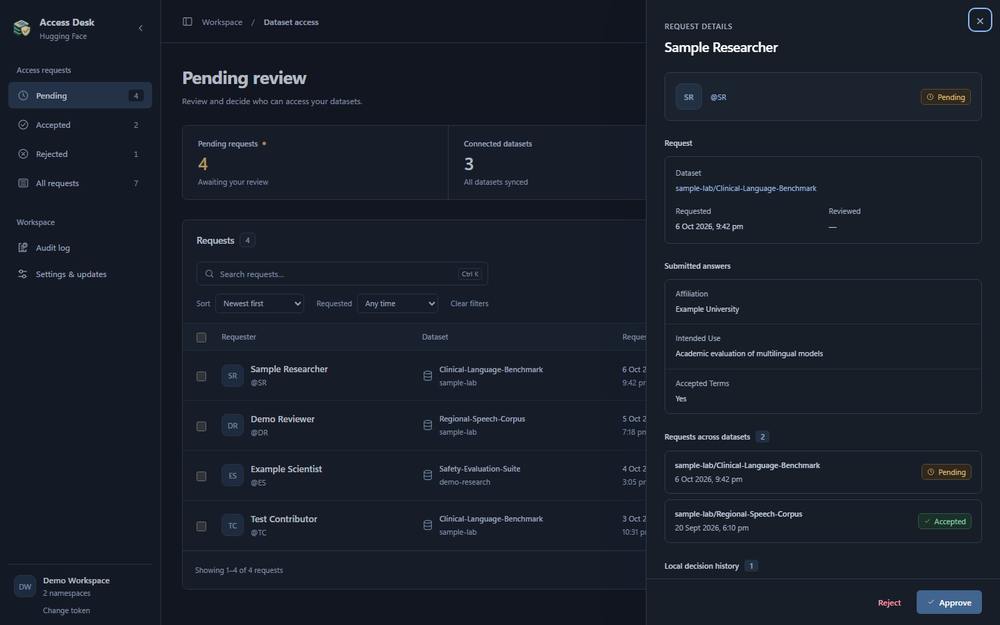
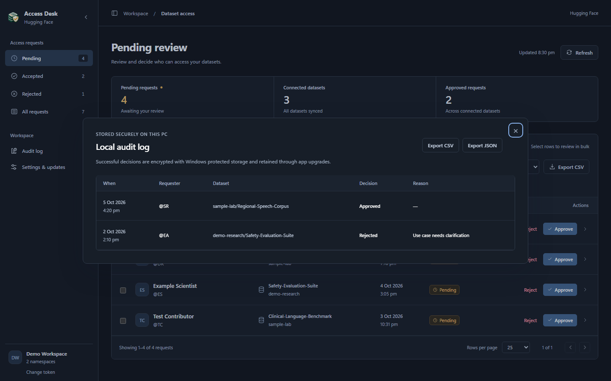
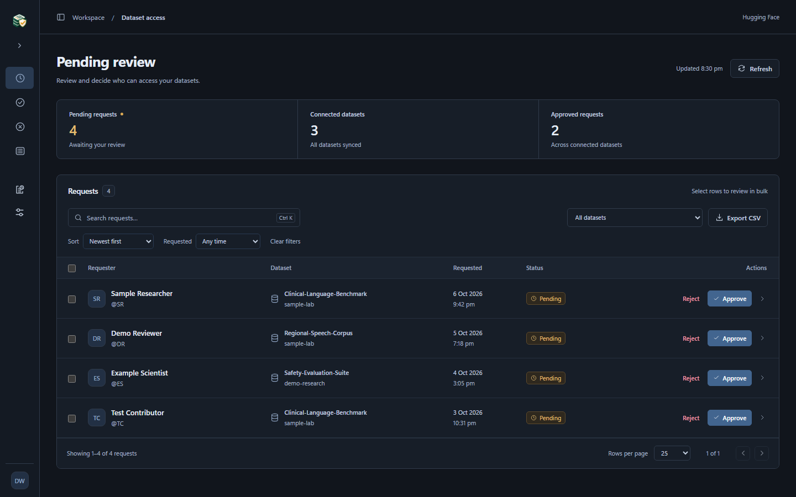
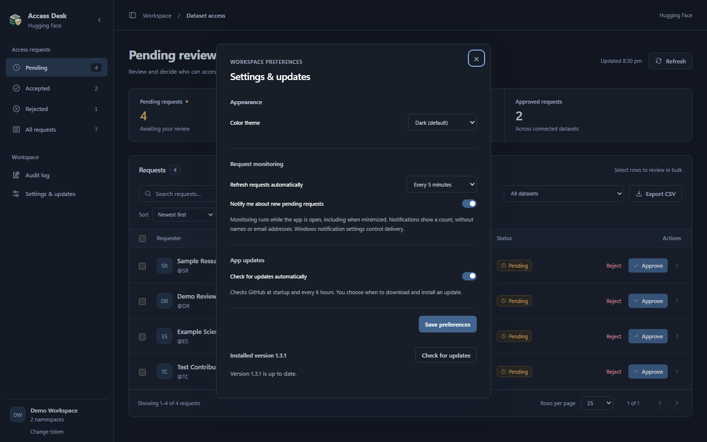

<p align="center">
  
</p>

<h1 align="center">HF Access Desk</h1>

<p align="center">
  Review and manage every gated Hugging Face dataset request from one private Windows desktop workspace.
</p>

<p align="center">
  <a href="https://github.com/samanjoy2/hf-manual/releases/tag/v1.3.1"></a>
  <a href="https://github.com/samanjoy2/hf-manual/releases/tag/v1.3.1"></a>
  
  
</p>

<p align="center">
  <a href="https://github.com/samanjoy2/hf-manual/releases/latest"><strong>Download for Windows</strong></a>
  · <a href="#what-you-can-do">Features</a>
  · <a href="#security-and-privacy">Security</a>
  · <a href="#build-from-source">Build from source</a>
  · <a href="https://github.com/samanjoy2/hf-manual/releases">All releases</a>
</p>


HF Access Desk brings pending, accepted, and rejected requests from all the gated datasets you manage into a single queue. Search once, filter by dataset, take individual or bulk action, and export the current view without juggling separate repository settings pages.

> [!NOTE]
> Every person, username, repository name, and count shown in this README is fictional demo data. No real access request or credential is included in the screenshots.

---

## What you can do

- Discover gated datasets across your personal account and writable organization namespaces.
- Review pending, accepted, rejected, or all requests in one consistent table.
- Approve, reject, revoke, reset, or return a request to pending.
- Select many requests and make one bulk decision.
- Page through large queues with 10, 25, 50, or 100 rows per page, keeping your selection across pages.
- Search by requester or dataset, narrow the queue by dataset and request date, and sort the results five ways.
- Open a request-details drawer to inspect submitted form answers without leaving the queue.
- Approve or reject directly from the details drawer after reading the submitted answers.
- See a requester's history across all connected datasets from the same details view.
- Export the current request list as CSV.
- Keep an encrypted local audit trail of successful decisions and export it as CSV or JSON.
- Refresh directly from Hugging Face whenever you need the latest state.
- Refresh automatically and receive Windows notifications when new pending requests arrive.
- Check for new GitHub releases, download a verified update, and choose when to install it.
- Open a requester's Hugging Face profile by clicking their handle, or search their email with Google in your default browser.
- Collapse the navigation sidebar to leave more room for large request queues; the preference is remembered locally.
- Use **Ctrl+K** to search and **Ctrl+B** to collapse or expand navigation.
- Replace or forget the saved token from inside the app.
- Start in dark mode by default, or choose Light or Follow Windows in **Settings & updates → Appearance**. Your choice is remembered.

## A look inside

The v1.3 interface follows the compact navigation and data-table patterns in [shadcn/ui](https://ui.shadcn.com/docs/components/sidebar), [Kibo UI](https://www.kibo-ui.com/components/table), and the consistent controls in [HeroUI](https://www.heroui.com/). These patterns are adapted to the app's native HTML/CSS renderer; no React library or paid template is bundled. Motion is limited to short panel transitions and respects the Windows reduced-motion preference.

Dark mode is the default from v1.3.1 onward, including when upgrading from earlier versions. The token setup, review queue, details drawer, audit log, settings, and native window all follow the selected theme. Choose **Follow Windows** to adapt automatically when Windows switches between light and dark.

| Secure first-run setup | One combined review queue |
| --- | --- |
|  |  |
| Paste your own token once. The app validates it before encrypted local storage. | See counts, datasets, request status, dates, and available actions at a glance. |

| Request context and history | Encrypted local audit trail |
| --- | --- |
|  |  |
| Inspect submitted answers and every request from the same user across connected datasets. | Review successful decisions and export the log as CSV or JSON. |

<details>
<summary><strong>Collapsed navigation view</strong></summary>
<br />

</details>

<details>
<summary><strong>Request monitoring and update settings</strong></summary>
<br />

</details>

## Download and install

HF Access Desk currently ships as a Windows x64 installer.

1. Open the [latest release](https://github.com/samanjoy2/hf-manual/releases/latest).
2. Download `HF-Access-Desk-Setup-<version>.exe` from **Assets**.
3. Run the installer and choose an installation folder.
4. Launch **HF Access Desk** from the Desktop or Start Menu shortcut.

The installer handles both situations automatically: it performs a clean installation when the app is not present, or upgrades the existing installation in place when an older version is detected. The encrypted token and application data are preserved during upgrades.

Open **Settings & updates** from the sidebar. The installed app checks for stable GitHub releases at startup and every six hours. Choose **Download update**, then **Install and restart** to run the normal installer. Downloads are verified against the release's SHA-256 checksum, including a second check before installation. Updates are never installed without your action. Versions earlier than v1.2.0 need one manual upgrade to gain this feature.

Requests refresh every five minutes by default. Change the interval or turn it off in **Settings & updates**. Monitoring works while the app is open, including when minimized; closing the app stops it. The first complete refresh establishes a baseline without announcing old requests. Later new pending requests generate one notification containing a count, without names, handles, or emails. Click it to open the pending queue. Windows notifications must be enabled for the app.

The community build is not currently code-signed. Windows SmartScreen may therefore show an **Unknown publisher** warning. Release notes include a SHA-256 checksum so you can verify the downloaded installer.

## First launch

The app asks for a Hugging Face user access token. Create and control tokens from [Hugging Face token settings](https://huggingface.co/settings/tokens). The selected token needs permission to:

- view access requests for gated repositories;
- write to each dataset whose requests you want to manage.

The token is validated before it is saved. It is never displayed again after setup and is never committed to this repository.

## Security and privacy

HF Access Desk is designed so the credential and Hugging Face API access stay in the privileged Electron main process.

| Protection | Implementation |
| --- | --- |
| Token at rest | Encrypted with Electron `safeStorage`, backed by Windows DPAPI |
| Audit history at rest | Successful decisions encrypted with the same Windows protected storage |
| Notification history at rest | Encrypted account baseline containing hashed request identifiers |
| Update downloads | Restricted to this GitHub repository's stable release assets, with SHA-256 integrity checks |
| Renderer isolation | Node.js integration disabled, context isolation enabled, sandbox enabled |
| API access | Hugging Face requests run only in the main process |
| IPC surface | A narrow preload bridge exposes only the operations the UI needs |
| Navigation | In-app navigation, popups, and browser permissions are denied by default |
| External links | Restricted to Hugging Face profiles, dataset pages, token settings, and Google email searches |
| Local removal | **Change token** lets you replace or forget the saved credential |

Encrypted credential and audit data are stored in Electron's per-user application-data directory and are tied to the current Windows sign-in. They do not enter the project folder.

## Build from source

Requirements:

- Windows 10 or newer
- Node.js 20 or newer
- Python with Pillow, used only to generate the multi-resolution Windows icon

```powershell
git clone https://github.com/samanjoy2/hf-manual.git
cd hf-manual
npm install
npm start
```

Useful development commands:

```powershell
npm run check        # Validate JavaScript syntax
npm run screenshots  # Rebuild README screenshots from fictional demo data
npm run check:ui     # Exercise the interface in headless Edge or Chrome
npm run dist:win     # Build the Windows NSIS installer
```

## How it is put together

The optional browser interface checks require Node.js 22 or newer and Microsoft Edge or Google Chrome. They use only fictional requests and a temporary browser profile.

```text
electron/main.cjs       Secure storage, Hugging Face API, app lifecycle
electron/preload.cjs    Narrow renderer-to-main bridge
public/                 Desktop interface and styles
scripts/                Icon and screenshot generation
build/                  Windows PNG/ICO assets
docs/screenshots/       Sanitized README images
```

The app calls Hugging Face's API directly; there is no HF Access Desk server and no localhost web service.

## Releases and source code

- [Latest stable release](https://github.com/samanjoy2/hf-manual/releases/latest)
- [Every published release](https://github.com/samanjoy2/hf-manual/releases)
- [Release history](CHANGELOG.md)
- [Source code](https://github.com/samanjoy2/hf-manual)
- [Report a bug or request a feature](https://github.com/samanjoy2/hf-manual/issues)

Future packaged versions will continue to appear under GitHub Releases with their installer, release notes, and integrity checksum. The matching source remains available through the release tag and repository history.

## Disclaimer

HF Access Desk is an independent community project. It is not affiliated with or endorsed by Hugging Face. Hugging Face names and marks belong to their respective owners.

---

<p align="center"><strong>One desk for every gated dataset decision.</strong></p>
