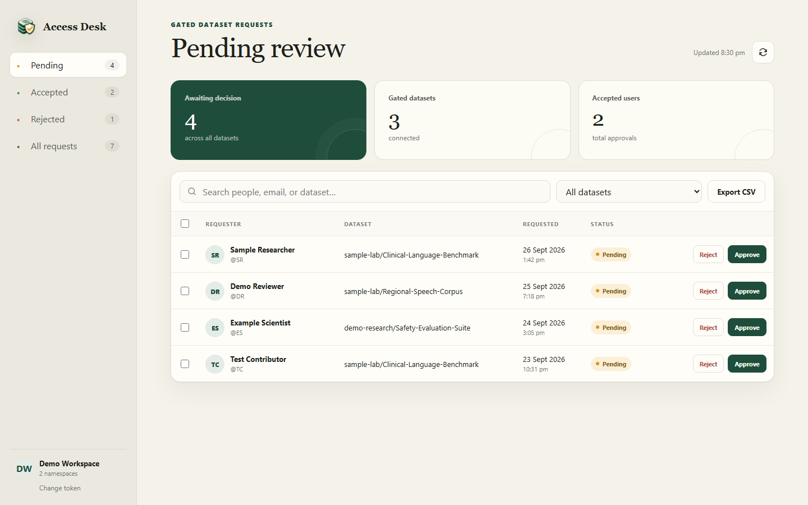
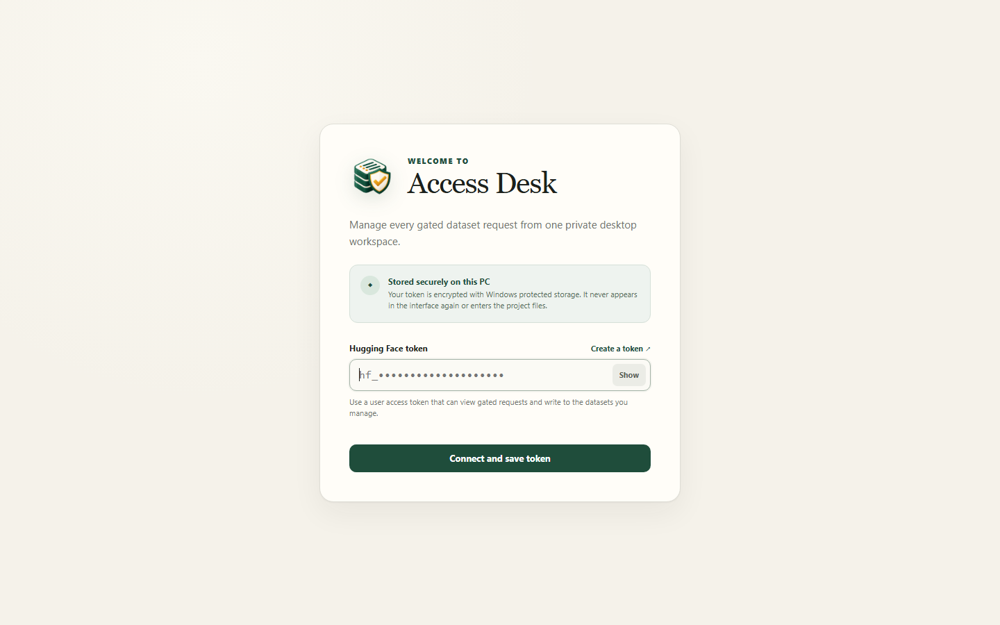

<p align="center">
  
</p>

<h1 align="center">HF Access Desk</h1>

<p align="center">
  Review and manage every gated Hugging Face dataset request from one private Windows desktop workspace.
</p>

<p align="center">
  <a href="https://github.com/samanjoy2/hf-manual/releases/latest"></a>
  <a href="https://github.com/samanjoy2/hf-manual/releases"></a>
  
  
</p>

<p align="center">
  <a href="https://github.com/samanjoy2/hf-manual/releases/latest"><strong>Download for Windows</strong></a>
  · <a href="#what-you-can-do">Features</a>
  · <a href="#security-and-privacy">Security</a>
  · <a href="#build-from-source">Build from source</a>
  · <a href="https://github.com/samanjoy2/hf-manual/releases">All releases</a>
</p>



HF Access Desk brings pending, accepted, and rejected requests from all the gated datasets you manage into a single queue. Search once, filter by dataset, take individual or bulk action, and export the current view without juggling separate repository settings pages.

> [!NOTE]
> Every person, username, repository name, and count shown in this README is fictional demo data. No real access request or credential is included in the screenshots.

---

## What you can do

- Discover gated datasets across your personal account and writable organization namespaces.
- Review pending, accepted, rejected, or all requests in one consistent table.
- Approve, reject, revoke, reset, or return a request to pending.
- Select many requests and make one bulk decision.
- Search by requester or dataset and narrow the queue with a dataset filter.
- Export the current request list as CSV.
- Refresh directly from Hugging Face whenever you need the latest state.
- Replace or forget the saved token from inside the app.

## A look inside

| Secure first-run setup | One combined review queue |
| --- | --- |
|  |  |
| Paste your own token once. The app validates it before encrypted local storage. | See counts, datasets, request status, dates, and available actions at a glance. |

## Download and install

HF Access Desk currently ships as a Windows x64 installer.

1. Open the [latest release](https://github.com/samanjoy2/hf-manual/releases/latest).
2. Download `HF-Access-Desk-Setup-<version>.exe` from **Assets**.
3. Run the installer and choose an installation folder.
4. Launch **HF Access Desk** from the Desktop or Start Menu shortcut.

The community build is not currently code-signed. Windows SmartScreen may therefore show an **Unknown publisher** warning. Release notes include a SHA-256 checksum so you can verify the downloaded installer.

## First launch

The app asks for a Hugging Face user access token. Create and control tokens from [Hugging Face token settings](https://huggingface.co/settings/tokens). The selected token needs permission to:

- view access requests for gated repositories;
- write to each dataset whose requests you want to manage.

The token is validated before it is saved. It is never displayed again after setup and is never committed to this repository.

## Security and privacy

HF Access Desk is designed so the credential and Hugging Face API access stay in the privileged Electron main process.

| Protection | Implementation |
| --- | --- |
| Token at rest | Encrypted with Electron `safeStorage`, backed by Windows DPAPI |
| Renderer isolation | Node.js integration disabled, context isolation enabled, sandbox enabled |
| API access | Hugging Face requests run only in the main process |
| IPC surface | A narrow preload bridge exposes only the operations the UI needs |
| Navigation | In-app navigation, popups, and browser permissions are denied by default |
| External links | Restricted to Hugging Face dataset pages and token settings |
| Local removal | **Change token** lets you replace or forget the saved credential |

Encrypted credential data is stored in Electron's per-user application-data directory and is tied to the current Windows sign-in. It does not enter the project folder.

## Build from source

Requirements:

- Windows 10 or newer
- Node.js 20 or newer
- Python with Pillow, used only to generate the multi-resolution Windows icon

```powershell
git clone https://github.com/samanjoy2/hf-manual.git
cd hf-manual
npm install
npm start
```

Useful development commands:

```powershell
npm run check        # Validate JavaScript syntax
npm run screenshots  # Rebuild README screenshots from fictional demo data
npm run dist:win     # Build the Windows NSIS installer
```

## How it is put together

```text
electron/main.cjs       Secure storage, Hugging Face API, app lifecycle
electron/preload.cjs    Narrow renderer-to-main bridge
public/                 Desktop interface and styles
scripts/                Icon and screenshot generation
build/                  Windows PNG/ICO assets
docs/screenshots/       Sanitized README images
```

The app calls Hugging Face's API directly; there is no HF Access Desk server and no localhost web service.

## Releases and source code

- [Latest stable release](https://github.com/samanjoy2/hf-manual/releases/latest)
- [Every published release](https://github.com/samanjoy2/hf-manual/releases)
- [Release history](CHANGELOG.md)
- [Source code](https://github.com/samanjoy2/hf-manual)
- [Report a bug or request a feature](https://github.com/samanjoy2/hf-manual/issues)

Future packaged versions will continue to appear under GitHub Releases with their installer, release notes, and integrity checksum. The matching source remains available through the release tag and repository history.

## Disclaimer

HF Access Desk is an independent community project. It is not affiliated with or endorsed by Hugging Face. Hugging Face names and marks belong to their respective owners.

---

<p align="center"><strong>One desk for every gated dataset decision.</strong></p>
